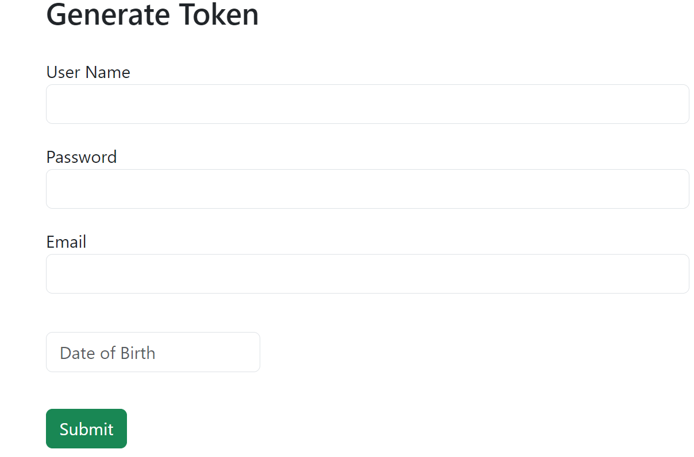

# OVERVIEW 
Welcome to my Assessment submission! This project showcases my Java programming skills and knowledge. It consists of three modules: Login Backend, Login Frontend, and Pancake Shop App. Each module addresses specific requirements.

## Modules
- **Login Backend**
The Login Backend module is a Spring Boot web application responsible for user authentication and validation. It utilizes Spring MVC and provides RESTful APIs for user-related operations. The backend validates user input for fields such as username, email, password, and date of birth. It ensures that the input adheres to specific validation requirements, such as length, format, and complexity.

**To run the Login Backend module:**

- Ensure you have Java Development Kit (JDK) installed.
- Navigate to the LoginBackend directory.
- Run the command ./mvnw spring-boot:run to start the application.
- Access the API endpoints via http://localhost:8080/swagger-ui/index.html# or the frontend: 
  .
- ### Additional Information
I have implemented the requested validation checks in the LogIn service class. The validations are performed concurrently using Java's CompletableFuture framework, ensuring efficient processing of multiple input fields. The results of the validations are returned as appropriate messages.

- **Login Frontend**
The Login Frontend module is an Angular application that interacts with the Login Backend module. It provides a user-friendly interface for users to enter their credentials and perform the validation checks. The frontend communicates with the backend via RESTful API calls and displays the validation results to the user.

**To run the Login Frontend module:**

- Ensure you have Node.js and Angular CLI installed.
- Navigate to the LoginFrontend directory.
- Run the command npm install to install the dependencies.
- Run the command ng serve to start the application.
- Access the frontend interface via http://localhost:4200.
- **Alternatively**, you can run the /demo folder in the login module on your web host eg Apache, Xamp, Chrome server, VS code server.

## Pancake Shop App
The Pancake Shop App is a console-based program that simulates a pancake shop scenario. It allows the shopkeeper to make pancakes, and three users to eat the pancakes simultaneously. The program enforces specific rules such as the maximum number of pancakes a user can eat and the maximum number of pancakes the shopkeeper can make within a given time frame. The program also provides outputs regarding time slots, pancake consumption, wastage, and unfulfilled orders.

To run the Pancake Shop App:

- Ensure you have Java Development Kit (JDK) installed.
- Navigate to the PancakeShopApp directory.
- Compile the Java files using the command javac *.java.
- Run the program using the command java Main.
- Observe the console output to see the results.

## Pancake Shop Program
The Pancake Shop App module provides two versions of the program: a non-concurrent version and a concurrent version. Both versions follow the requirements specified in the assessment.

### Observations:

The concurrent version outperforms the non-concurrent version in terms of execution time due to parallelism.
With the concurrent version, users can eat their pancakes concurrently, and the shopkeeper can prepare pancakes for multiple users simultaneously, resulting in improved efficiency.
The non-concurrent version performs pancake consumption sequentially, resulting in longer execution time.
Both versions fulfill the requirements of the assessment, but the concurrent version provides better performance by leveraging parallelism without using traditional threads or executor services.
